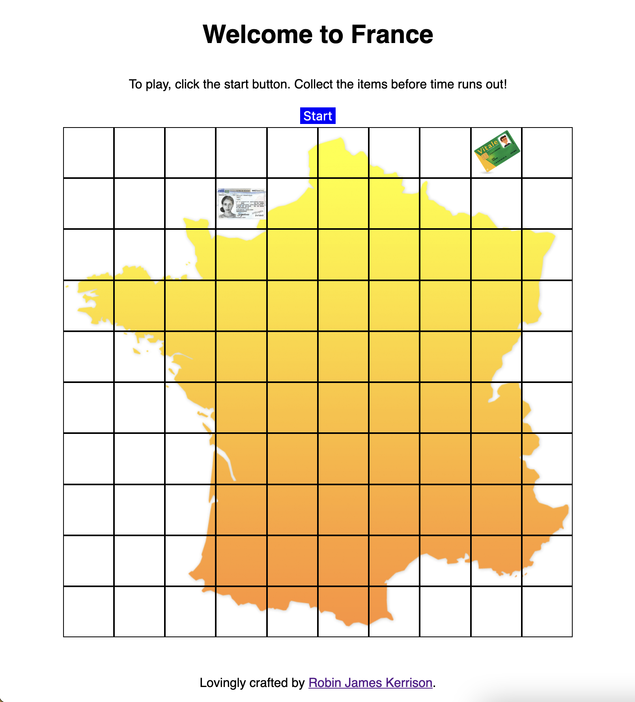
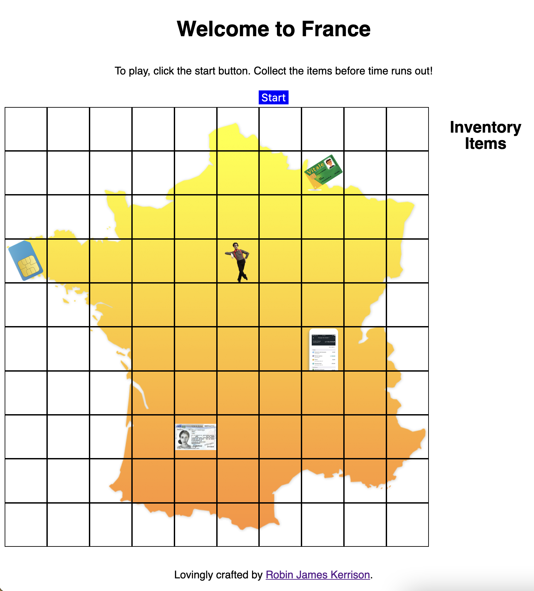
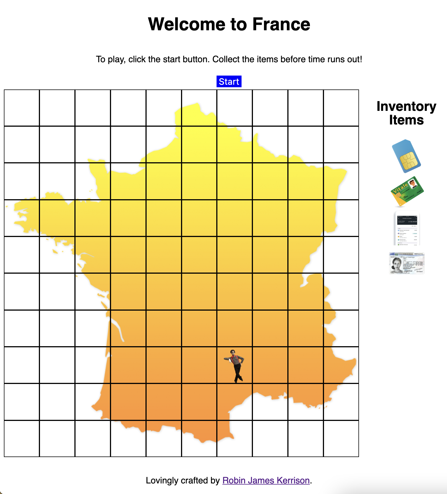

# Lab: Welcome to France Game

This is a lab for a Web Development course.
This lab gives an opportunity to practice grid movement and collision detection ideas, and to build a small game.

Your goal is to create a game where the hero has to collect
all of the required _papiers_ before time runs out.

The images and audio have been provided for you,
as has a starting page.

## Iteration 1: Populate the Grid

There is already a `<div class="grid">` in `index.html`.

In `js/main.js`, get a reference to this element.
Add to it as many cells as required to make a 10 by 10 grid.

Each cell should have the class `'cell'`. Styling has been provided in `styles/main.css`.

When creating each cell, store it in an array you can use to access the cells later.

You should also add a data attribute for identifying its index, such as

```js
cell.dataset.index = i
```

This will be useful later when checking player boundary conditions.

## Iteration 2: Display the collectibles

When the use clicks on the button to start the game, display the collectibles in randomly chosen positions.

You may want to keep track of whether the game is started, and organise your starting function as an object method.

In order to avoid two collectibles in the same box, you can use an algorithm which chooses multiple options randomly.
Use the code below for performing a Fisher-Yates shuffle to take a random selection from your array.

```js
function fisherYatesShuffle(arr) {
  for (let i = arr.length; i > 0; i--) {
    const j = Math.floor(Math.random() * i)
    const temp = arr[j]
    arr[j] = arr[i - 1]
    arr[i - 1] = temp
  }
}

function getRandomSelection(n, array) {
  const cloned = Array.from(array)
  const shuffled = fisherYatesShuffle(cloned)
  const selected = shuffled.slice(0, n)
  return selected
}
```

The full list of collectibles as class names are as follows:

```js
const collectibles = [
  'carte-vitale',
  'titre-de-sejour',
  'sim-card',
  'compte-bancaire',
]
```



## Iteration 3: Display the player

Show the player in the starting position.

When the user presses an arrow , move the player in the corresponding direction.

The player cannot leave the boundaries of the board,
and can only move up, down, left, or right.

Before the game has started, the player should not be able to move.
Control this by having a conditional which checks that the game has started.



## Iteration 4: Collect the items

When the player enters a cell where there is an item,
that item should be collected.

Once the player has collected all of the items, the player has won and the game is over.



## Iteration 5: Play _La Marseillaise_ on winning

When the user wins, play _La Marseillaise_ to congratulate them.

The audio file you need is provided at `audio/la-marseillaise.ogg`.

The national anthem of the republic should stop when the user restarts the game.

## BONUS: Impose a time limit

Add a clock which counts down.
When the clock reaches zero, the player has lost.
If the player wins before the clock hits zero, stop the clock.
